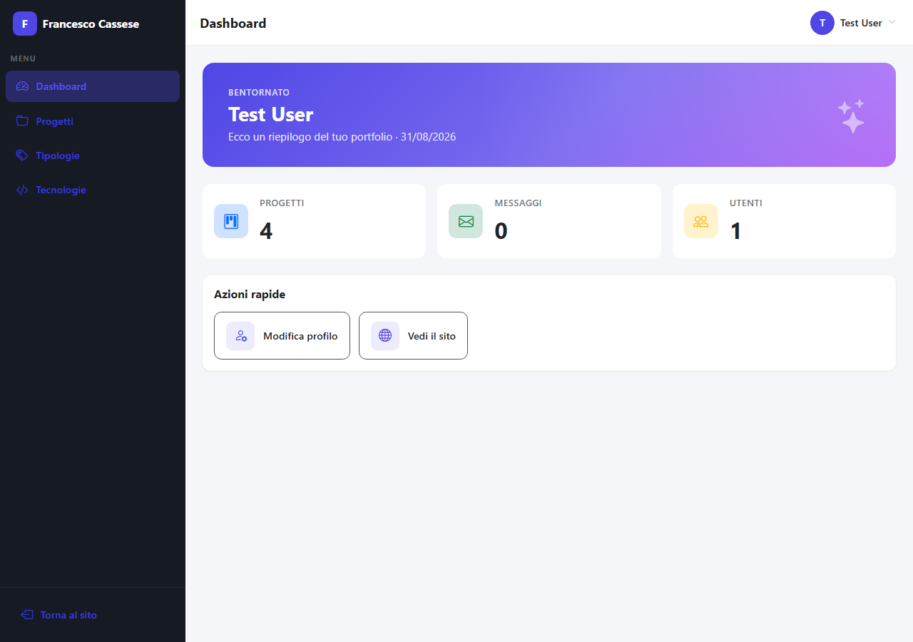

# 🖼️ Laravel Portfolio — Sito Personale con Area Admin e Gestione Progetti

Applicazione web in Laravel per un portfolio personale, con autenticazione utente e un'area admin protetta per gestire i progetti mostrati sul sito. Esercizio della specializzazione PHP: parte dallo scaffolding di autenticazione con Laravel Breeze e si evolve in un piccolo CMS per progetti, tipologie e tecnologie, con relazioni Eloquent uno-a-molti e molti-a-molti.

Nessun frontend framework, solo Laravel con Blade, Bootstrap e uno stile personalizzato per l'area admin.

## ✨ Funzionalità

- Autenticazione completa via **Laravel Breeze** (login, registrazione, reset password, conferma password, verifica email) con UI in Bootstrap
- Gestione profilo utente (modifica dati, aggiornamento password, cancellazione account) tramite `ProfileController`
- Area admin protetta dal middleware `auth`, raggiungibile alla rotta `/admin`, con layout dedicato e sidebar di navigazione responsive (offcanvas su mobile)
- Dashboard admin con hero banner di benvenuto, stat card e sezione di azioni rapide
- **CRUD completo dei progetti** (`ProjectController`): titolo, slug, descrizione, immagine di copertina (upload su disco `public`), link al repository GitHub, tipologia e tecnologie utilizzate
- **CRUD delle tipologie di progetto** (`TypeController`) e **CRUD delle tecnologie** (`TechnologyController`), entrambi raggiungibili dalla sidebar admin
- Relazione **uno-a-molti** tra `Project` e `Type` (un progetto ha una tipologia) e relazione **molti-a-molti** tra `Project` e `Technology` tramite la tabella pivot `project_technology` (un progetto può avere più tecnologie, selezionabili via checkbox nei form)
- Home page pubblica con hero e griglia dei progetti più recenti, badge colorati per le tecnologie associate a ciascun progetto
- Seeder realistici: tipologie, tecnologie e progetti demo con le rispettive associazioni già popolate
- Stile custom in **SCSS**, organizzato secondo il pattern **7-1** (abstracts, base, components, layout, pages), con Bootstrap Icons e senza librerie JS aggiuntive

## 📸 Screenshot



## 🎯 Obiettivi dell'esercizio

La traccia dell'esercizio richiedeva di:

- Installare un progetto Laravel da zero.
- Installare Laravel Breeze come starter kit di autenticazione, con Bootstrap al posto dello scaffolding Tailwind di default.
- Verificare che il flusso di autenticazione (registrazione, login, logout, gestione profilo) funzioni correttamente.
- Creare un layout dedicato per un'area admin, protetta da autenticazione, distinto dal layout del sito pubblico.
- Estendere l'area admin con la gestione CRUD dei progetti del portfolio, delle relative tipologie e delle tecnologie utilizzate, comprese le relazioni Eloquent uno-a-molti e molti-a-molti tra i model.

## 🛠️ Stack tecnico

- Laravel 11 / PHP 8.2+, con Laravel Breeze per l'autenticazione
- Blade per le viste, Bootstrap 5 + Bootstrap Icons, SCSS con variabili custom (pattern 7-1)
- Vite per l'asset bundling, gestito con pnpm
- MySQL come database

## 📁 Struttura del progetto

```
laravel-portfolio/
├── app/
│   ├── Http/Controllers/
│   │   ├── Admin/
│   │   │   ├── ProjectController.php    # CRUD progetti (immagine, tipologia, tecnologie)
│   │   │   ├── TypeController.php       # CRUD tipologie di progetto
│   │   │   └── TechnologyController.php # CRUD tecnologie
│   │   ├── Auth/                        # Controller di autenticazione (Breeze)
│   │   └── ProfileController.php        # Gestione profilo utente
│   └── Models/
│       ├── Project.php                  # belongsTo Type, belongsToMany Technology
│       ├── Type.php                     # hasMany Project
│       └── Technology.php               # belongsToMany Project
├── database/
│   ├── migrations/                      # projects, types, technologies, pivot project_technology...
│   └── seeders/                         # TypeSeeder, TechnologySeeder, ProjectSeeder (con associazioni)
├── resources/
│   ├── scss/                            # Pattern 7-1: abstracts, base, components, layout, pages
│   └── views/
│       ├── layouts/
│       │   ├── app.blade.php            # Layout sito pubblico
│       │   ├── guest.blade.php          # Layout pagine di autenticazione
│       │   └── admin.blade.php          # Layout area admin (sidebar + topbar)
│       ├── auth/                        # Viste di login, registrazione, reset password...
│       ├── profile/                     # Viste di gestione profilo
│       ├── admin/
│       │   ├── dashboard.blade.php      # Dashboard area admin
│       │   ├── projects/                # index/create/edit/show progetti
│       │   ├── types/                   # index/create/edit tipologie
│       │   └── technologies/            # index/create/edit tecnologie
│       └── home.blade.php               # Homepage pubblica con griglia progetti
├── routes/
│   ├── web.php                          # Rotte pubbliche, profilo e admin (resource routes)
│   └── auth.php                         # Rotte di autenticazione (Breeze)
└── README.md
```

## 🚀 Come avviare il progetto

### Requisiti

- PHP 8.2 o superiore
- Composer
- Node.js con pnpm
- Un server MySQL

### Setup

Clona il progetto:

```bash
git clone https://github.com/francesco-cassese/laravel-portfolio.git
cd laravel-portfolio
```

Installa le dipendenze PHP e JS:

```bash
composer install
pnpm install
```

Copia il file d'ambiente e genera la chiave dell'applicazione:

```bash
cp .env.example .env
php artisan key:generate
```

Configura le variabili `DB_*` nel file `.env` con le credenziali del tuo database MySQL, quindi crea il database, esegui le migration e popola i dati demo (tipologie, tecnologie e progetti di esempio):

```bash
php artisan migrate --seed
```

Crea anche il link simbolico per servire pubblicamente le immagini caricate dei progetti:

```bash
php artisan storage:link
```

Avvia il server Laravel e il dev server di Vite:

```bash
php artisan serve
pnpm dev
```

Poi visita [http://localhost:8000](http://localhost:8000) per il sito pubblico, registra un account e accedi a [http://localhost:8000/admin](http://localhost:8000/admin) per l'area admin. In ambiente locale è disponibile anche la rotta `/_debug_login`, che autentica automaticamente il primo utente e reindirizza alla dashboard.

## 🔎 Come funziona

- Le rotte di autenticazione sono gestite da Laravel Breeze (`routes/auth.php`): registrazione, login, logout, reset e conferma password, verifica email.
- Il gruppo di rotte protetto da `auth` in `routes/web.php` espone `/profile` (modifica profilo tramite `ProfileController`) e `/admin`, dove sono registrate le resource route per progetti (`admin.projects.*`), tipologie (`admin.types.*`) e tecnologie (`admin.technologies.*`).
- Il layout `layouts/admin.blade.php` definisce la struttura dell'area admin: sidebar di navigazione (Dashboard, Progetti, Tipologie, Tecnologie) con offcanvas responsive, topbar con dropdown utente e logout, e uno slot `@yield('content')` per le singole viste.
- `ProjectController` gestisce la creazione e modifica dei progetti: salva l'immagine di copertina caricata nello storage `public`, assegna la tipologia scelta (`type_id`) e sincronizza le tecnologie selezionate tramite checkbox nella tabella pivot `project_technology` (`sync()` quando ce n'è almeno una, `detach()` quando nessuna è selezionata).
- Le relazioni Eloquent collegano i model: `Project::type()` (`belongsTo`) e `Project::technologies()` (`belongsToMany`), con gli inversi `Type::projects()` (`hasMany`) e `Technology::projects()` (`belongsToMany`).
- La pagina di dettaglio progetto (`admin/projects/show.blade.php`) mostra la tipologia e i badge delle tecnologie associate, colorati in base al campo `color` di ciascuna `Technology`.
- La homepage pubblica (`home.blade.php`) mostra gli ultimi progetti inseriti in una griglia di card, con le relative tecnologie.
- I seeder (`TypeSeeder`, `TechnologySeeder`, `ProjectSeeder`, eseguiti in quest'ordine da `DatabaseSeeder`) popolano tipologie, tecnologie e progetti demo con link GitHub reali e le associazioni progetto-tecnologie già create.
- Lo stile dell'area admin e del sito pubblico è organizzato in `resources/scss/` secondo il pattern 7-1 (abstracts, base, components, layout, pages), senza dipendenze JS aggiuntive oltre a Bootstrap.

## 👤 Autore

Francesco Cassese
